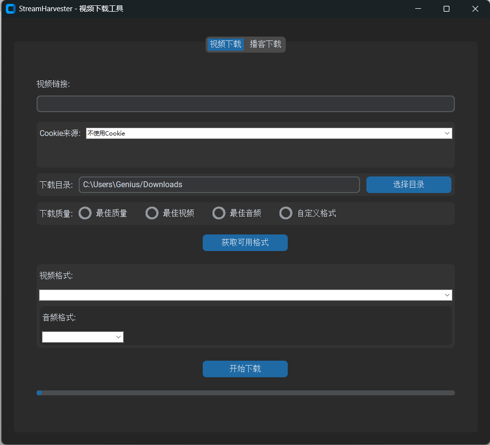

# StreamHarvester

一个功能强大的视频和播客下载工具，支持多个平台。

## 功能特点

- 支持多个视频平台（YouTube、Bilibili等）
- 支持播客下载（Apple Podcasts、小宇宙 FM）
- 自动获取登录状态（Cookie）
- 支持选择视频质量
- 支持批量下载
- 现代化的图形界面

## 安装说明

1. 确保已安装 Python 3.8 或更高版本
2. 克隆仓库：
   ```bash
   git clone https://github.com/atlasz/StreamHarvester.git
   cd StreamHarvester
   ```
3. 安装依赖：
   ```bash
   pip install -r requirements.txt
   ```

## 使用说明

### 视频下载



1. 运行程序：
   ```bash
   python main.py
   ```
2. 在"视频下载"标签页中：
   - 输入视频链接
   - 选择是否使用 Cookie（如果需要登录）
   - 点击"获取可用格式"
   - 选择需要的视频质量
   - 点击"下载选中"
   - 下载后的视频文件名会在标题后附加所选分辨率，例如 `video-1080p.mp4`

### 播客下载


1. 切换到"播客下载"标签页
2. 输入 Apple Podcast 或小宇宙 FM 链接（例如：`https://podcasts.apple.com/cn/podcast/xxx` 或 `https://www.xiaoyuzhoufm.com/episode/xxxxx`）
3. 选择下载目录
4. 点击"获取播客列表"
5. 选择要下载的单集
6. 点击"下载选中"

## 打包说明

如果您想将程序打包成可执行文件（.exe），请按以下步骤操作：

1. 确保已安装所有依赖：
   ```bash
   pip install -r requirements.txt
   ```

2. 运行打包脚本：
   ```bash
   python build.py
   ```

3. 打包完成后，可在 `dist` 目录下找到 `StreamHarvester.exe`
   - 这是一个独立的可执行文件，可以直接运行
   - 无需安装 Python 或其他依赖
   - 支持在 Windows 系统上直接双击运行

## 注意事项

- 使用 Cookie 功能时，请确保已在浏览器中登录目标网站
- 下载的视频和播客文件会保存在选择的目录中
- 支持批量下载，可以一次选择多个视频或播客单集

## 依赖项

- yt-dlp>=2024.3.10
- customtkinter>=5.2.2
- pillow>=10.2.0
- urllib3>=1.26.17,<3.0.0
- browser-cookie3>=0.19.1
- beautifulsoup4>=4.12.0
- requests>=2.31.0
- selenium==4.18.1
- webdriver-manager==4.0.1
- lxml>=5.1.0
- pyinstaller>=6.5.0

## 许可证

MIT License 